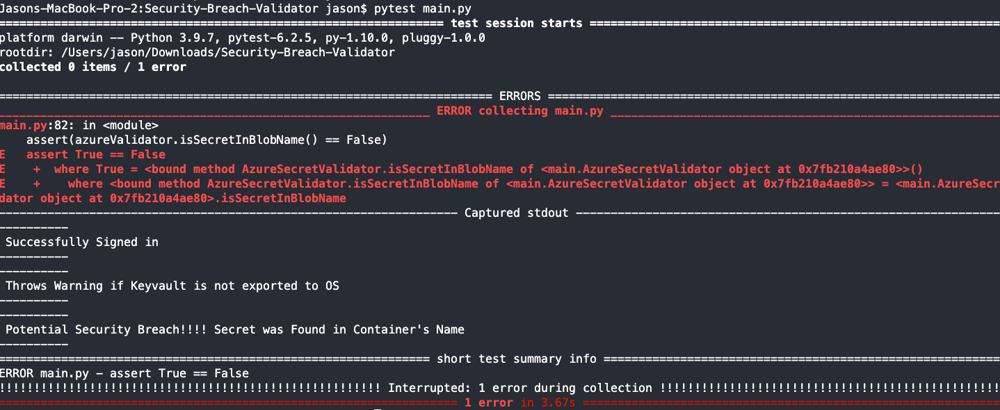
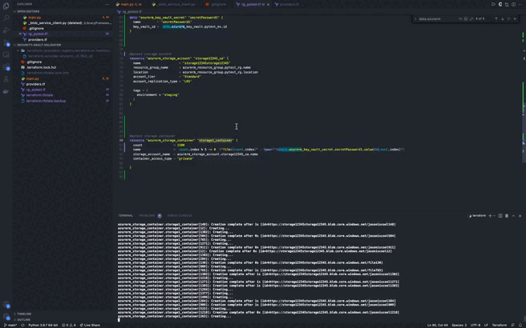
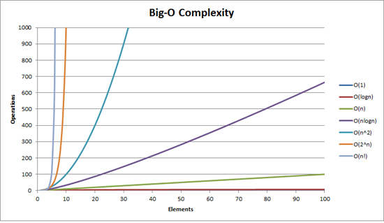

## Security Blob Validator 

The Security Blob Validator looks for a container matching an existing secret value (which should be hidden ofcourse!). 

## Tools
- Infrastructure: Azure for ou
- IaC: Terraform 1.0
- Dev: Python 3.9.7 
- Other: Pytest

## Why 1500 Containers????????

I created a count, and referenced an existing secret to mimick a potential security risk: Terraform's declaritive syntax was perfect.

**In summary, I wanted to see how far my Macbook Pro would go before crashing**

## Ways for Improvements

In real life, the containers would have already existed. From then on we would use python to iterate through all the containers. 

The next step here would be to use main.py to read the blob file's content, and link the results to [Azure Test plans](https://azure.microsoft.com/en-us/services/devops/test-plans/). 

I suspect the Computation would take O(n2), or optimally O(n log n).

